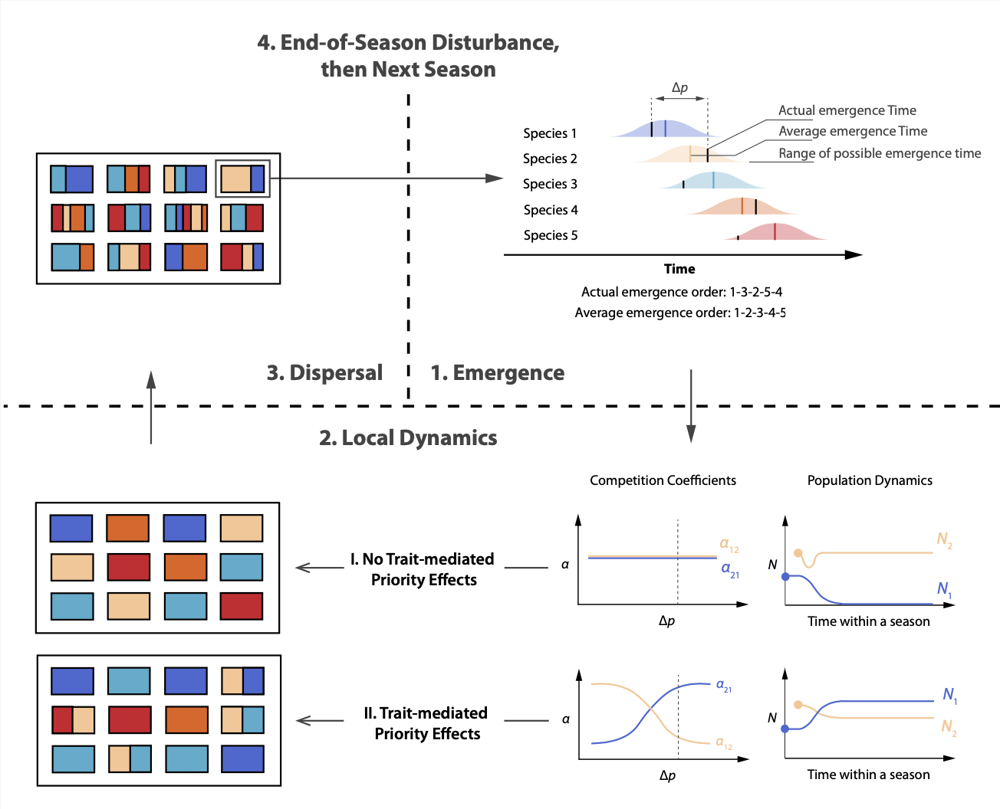
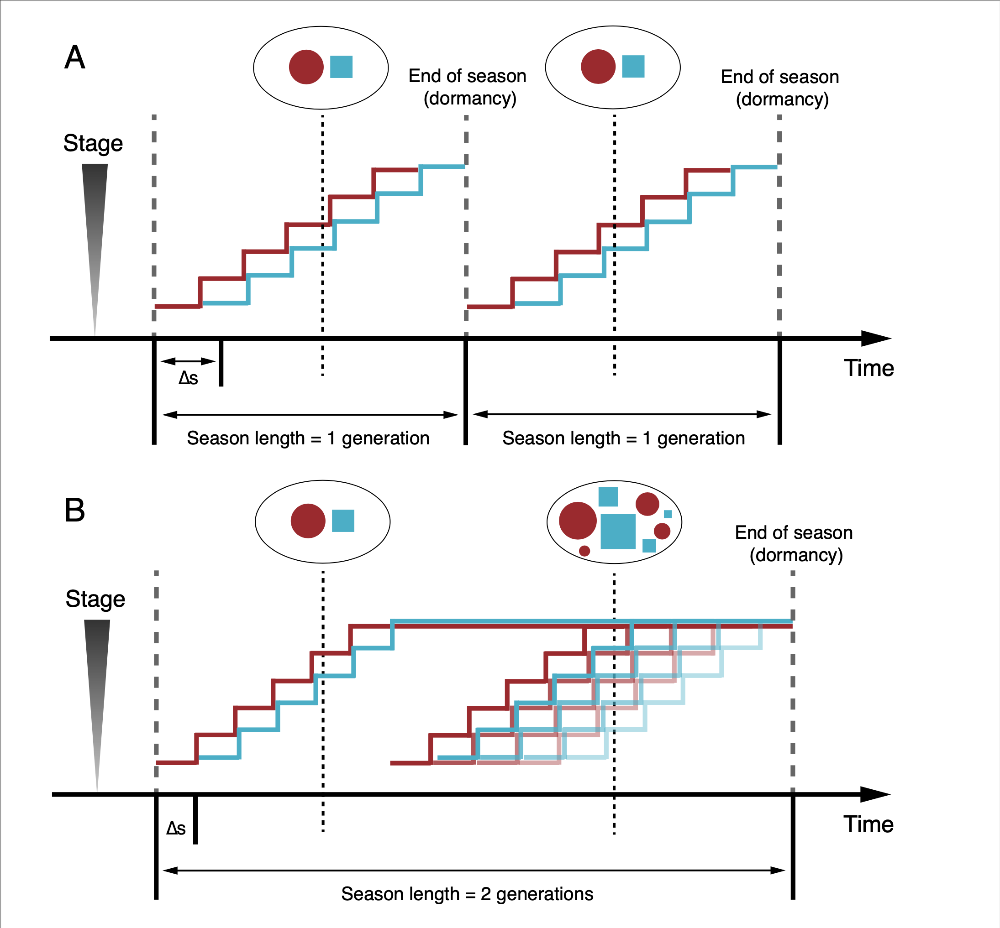
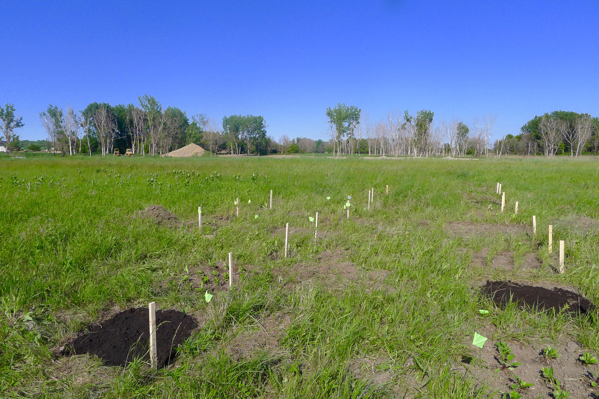

## RESEARCH THEME

One of the overarching theme of ecology is studying how biotic interactions change under different environmental factors, and how these changes affect community structure and biodiversity. I tackle this 

My research combines theoretical and experimental approaches to investigate how the timing of species arrival affects community structure. The temporal sequence of species arrival often affects species interactions within a community, contributing to priority effects. For my dissertation, I will first explore the concept of priority effects by reviewing the empirical mechanisms that could generate them. I will then design simulations and experiments to investigate the long-term consequences of priority effects arising from different mechanisms across three different scales, temporal, spatial, and interaction complexity. 

[Google Scholar Profile](https://scholar.google.com/citations?user=SJUUl-0AAAAJ&hl=en) | [Downloadable CV](../documents/CV_HengxingZou.pdf)

## CURRENT PROJECTS

### Priority Effects and Dispersal-Diversity Relationships

Priority effects are ubiquitous in nature and determine local community structure, but we know surprisingly little about how it influences biodiversity across different spatial scales. Here, we use a seasonal metacommunity model to show that biodiversity patterns and the homogenizing effect of high dispersal depend on the specific mechanisms underlying priority effects. When priority effects are driven by a numeric advantage, diversity measurements are highly sensitive to initial conditions and high dispersal homogenizes communities. However, when local priority effects arise from phenological shifts that alter species interaction strength (trait-mediated priority effects), local, regional, and temporal diversity are higher and are surprisingly robust to variation in dispersal and initial conditions, given spatiotemporal variations in phenology. Our results highlight that accounting for the mechanisms underlying priority effects is fundamental to understanding the maintenance of regional biodiversity.

**Preprint**

Zou, H.-X., and V. H. W. Rudolf. 2022. Priority effects determine how dispersal affects biodiversity in seasonal metacommunities. *bioRXiv*. [https://doi.org/10.1101/2022.02.03.479022](https://doi.org/10.1101/2022.02.03.479022).

### Effect of Arrival Time and Season Lengths on Coexistence

Recent studies on phenological shifts under climate change have generated renewed interest in priority effects, but their role in shaping the long-term dynamics of seasonal communities is poorly resolved. Here we use a general stage-structure competition model to determine how different types of priority effects influence the long-term coexistence of species in seasonal systems. We show that while shifts in mean and variance of relative arrival time can alter the persistence and coexistence conditions of species, these effects depend on season length and type of priority effect. Our results suggest that empirically observed priority effects may arise from fundamentally different mechanisms and that fast-generating systems may be less impacted by seasonal variation in phenology. Our model provides important insight into how natural communities respond to increasing variation in phenology over seasons under climate change.

**Preprint**

Zou, H.-X., and V. H. W. Rudolf. 2020. Priority effects and season length shape long-term competition dynamics. *bioRxiv*. [https://doi.org/10.1101/2020.08.14.251926](https://doi.org/10.1101/2020.08.14.251926)

## PAST PROJECTS

### Primary Succession of Plant Community on Industrial Waste

Slag, waste from the steel-making process, contains large amounts of calcium, magnesium, iron and other heavy metals. While many sites have undergone active restoration, traditional methods such as topsoil capping or phytoremediation performed poorly. Nevertheless, slag hosts surprisingly diverse spontaneous plant communities, but the assembly and structure of such communities is poorly studied. Collaborating with [Cathy Pfister](https://pfisterlab.uchicago.edu/) and [Alison Anastasio](https://sites.google.com/site/alisonanastasio/), we characterized plant communities on two slag sites in Calumet region on the south side of Chicago. Together with controlled experiments, we showed that species composition was fundamentally different between slag and non-slag communities and that slag communities recovered slower from disturbance, suggesting a slower succession process. Interestingly, native plants with high conservation values were also spotted on slag, highlighting the potential of industrial sites serving as native plant refugia through habitat reclamation.

**Publication**

Zou H.-X., A. E. Anastasio, and C. A. Pfister. 2019. Early succession on slag compared to urban soil: A slower recovery. *PLoS ONE* 14(12): [e0224214](https://doi.org/10.1371/journal.pone.0224214).
